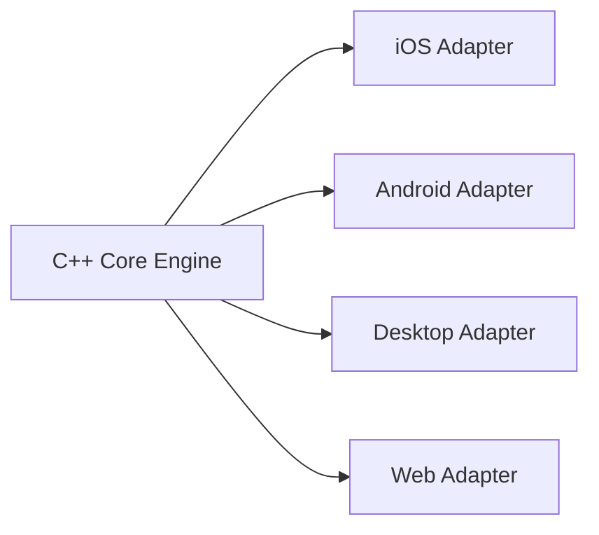

# LBCharts · 跨端行情技术图表

> 自研行情技术图表，基于 C++ 编写，跨设备、跨平台支持，可运行在 iOS / Android / Desktop / Web 等多种设备和平台。

**导航**：[首页](/) · [功能能力](/features.html) · [平台支持](/platforms.html) · [路线图](/roadmap.html) · [官网链接](https://lbchart.com)

---

## 项目简介

`LBCharts` 是一套面向金融行情场景的**跨端技术图表引擎**。  
以 C++ 作为核心实现，通过统一能力抽象与平台适配，支持在多端一致地交付复杂图表功能。

## 核心价值

- 目前已经完成手机客户端、桌面端客户端替换，并已上线发布。
- 解决图表功能重复开发的问题，极大提高了图表相关业务开发效率。
- 功能多端统一，通过配置控制不同平台功能及特性。

## 快速入口

- 功能能力详情：[`/features.html`](/features.html)
- 平台支持详情：[`/platforms.html`](/platforms.html)
- 版本路线图：[`/roadmap.html`](/roadmap.html)

## 平台覆盖

| 平台 | 状态 | 说明 |
| --- | --- | --- |
| iOS | ✅ 已上线 | 客户端替换完成 |
| Android | ✅ 已上线 | 客户端替换完成 |
| Desktop | ✅ 已上线 | 桌面端替换完成 |
| Web | ✅ 支持 | 可运行于现代浏览器 |

## 内置能力

- 内置至少 **60+** 种常用指标：`KDJ`、`RSI`、`MACD`...
- 丰富的画线类型：空间尺、3 线段、黄金分割...
- 丰富的内置功能：股票叠加、筹码分布、买卖点、行动点...
- 内置多种主题，支持自定义组件配色。

<b>查看能力清单（Demo）</b>

- [x] K 线 / 分时图
- [x] 常用技术指标
- [x] 多端统一交互
- [x] 主题切换
- [ ] 指标市场扩展（规划中）

## 架构示意

## 相关链接

- 跨端图表 **LBCharts**：<https://lbchart.com>
- GitHub Pages 首页：<https://lbchart.com>
