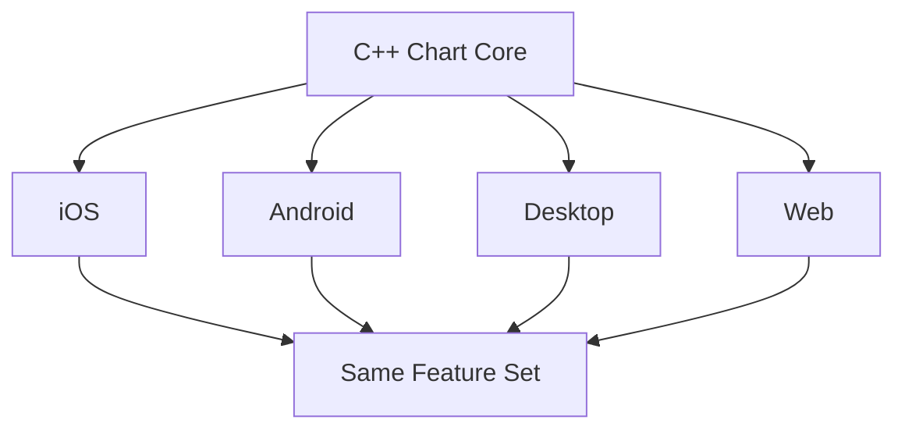

# LBCharts 平台支持

**导航**：[首页](/) · [功能能力](/features.html) · [平台支持](/platforms.html) · [路线图](/roadmap.html) · [官网链接](https://lbchart.com)

---

## 覆盖范围

LBCharts 基于 C++ 核心实现，通过平台适配层在不同终端复用同一套图表能力。

| 平台 | 状态 | 当前进展 | 说明 |
| --- | --- | --- | --- |
| iOS | ✅ 已上线 | 客户端替换完成 | 支持绘制、交互、主题、配置 |
| Android | ✅ 已上线 | 客户端替换完成 | 支持绘制、交互、主题、配置 |
| Desktop | ✅ 已上线 | 客户端替换完成 | 支持绘制、交互、主题、配置 |
| Web | ✅ 支持 | 可运行于现代浏览器 | 支持图表展示与交互能力 |

## 统一能力

- 统一渲染逻辑，降低多端重复开发成本。
- 统一交互模型，减少平台行为差异。
- 统一配置入口，按端控制功能特性。

## 技术示意

---

- 查看功能详情：[`/features.html`](/features.html)
